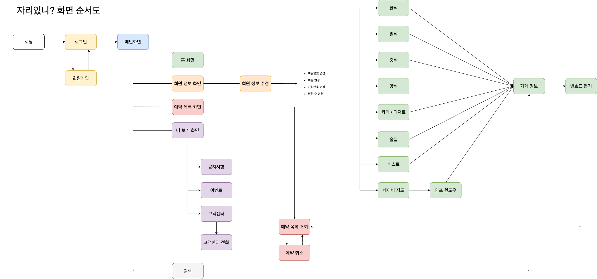

# 자리있니?

##  어떻게 시작하게 되었나요?

> 골목식당을 보면서 '연돈'이라는 돈가스 집이 방영 되었습니다. 돈가스가 엄청 맛있다고 백종원님이 말씀하시면서 유명해졌습니다. 새벽 3시부터 기다리는 사람이 있고 기본 3~4시간을 기다려야 먹을 수 있었습니다. 이런 문제를 발견하고 원격 번호표를 뽑을 수 있는 앱이 있으면 좋겠다고 생각하여 시작하였습니다.

###  개발 기간

  2020. 04 ~ 2020. 11

###  사용된 언어 및 기술 스택

* Java
* Apache
* PHP
* MariaDB
* JSON
* Naver Map API
* Retrofit2
* Glide

## 프로젝트 설명

###  화면 구성도

###  코드 설명 및 API 문서

 자리있니? : [https://beakjangmi.gitbook.io/android\_jari/](https://beakjangmi.gitbook.io/android_jari/)

 API : [https://beakjangmi.gitbook.io/jari-api/](https://beakjangmi.gitbook.io/jari-api/)

##  만든이

> [이장희](https://github.com/LeeJangHee) : 대구한의대학교 스마트IT전공 15학번
>
>   e-mail : sj90947@naver.com

